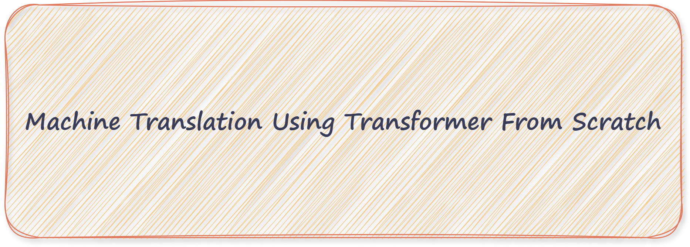

<h1 align="center">Hi 👋, it's a Machine Transilation using Transformer from Scratch project </h1>
<h3 align="center">
  
</h3>

- #### 🌱 If you want to convert your knowledge about transformer from therotical to practiacal , It' a good step and wish you the best ^ ^
-  ### 🔭 My goals from this project are:

    #####  Practise and increase my experience in PyTorch
    #####  Convert theoretical into practical which will help me when I read Paper imagine the implementation process

- 🌱 Our Dataset is [Opus Books](https://huggingface.co/datasets/Helsinki-NLP/opus_books) which got from HuggingFace 
- 🔭 This project inheritance from Eng [Umar Jamil](https://www.youtube.com/watch?v=ISNdQcPhsts&t=9999s) . " If you are Non-Arabs, I recommend to focus in theoretical part well before go further "

- 🌱 If you don't know what is the Transformer ? I recommend to watch this video for Eng [Abu Bakr Soliman](https://www.youtube.com/watch?v=6JGzwI2pNfo&t=14s) " For Arabs " 
